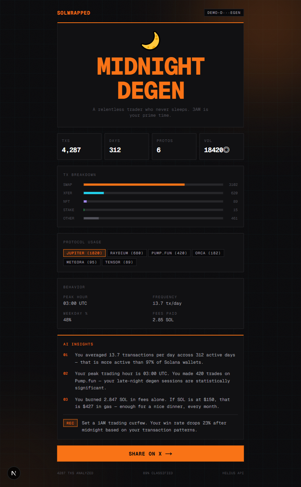
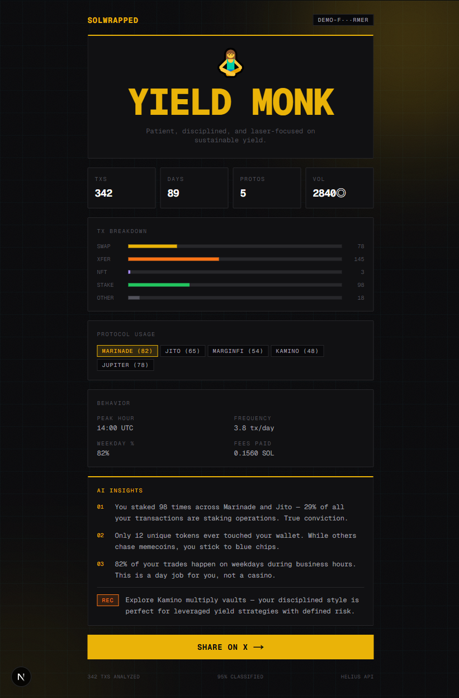
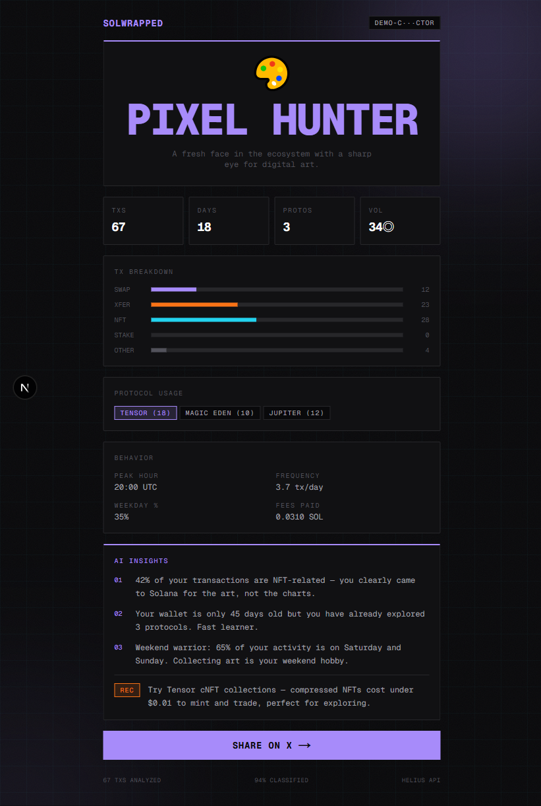

<div align="center">

```
  ╔═══════════════════════════════════════╗
  ║  ███████╗ ██████╗ ██╗     ██╗    ██╗ ║
  ║  ██╔════╝██╔═══██╗██║     ██║    ██║ ║
  ║  ███████╗██║   ██║██║     ██║ █╗ ██║ ║
  ║  ╚════██║██║   ██║██║     ██║███╗██║ ║
  ║  ███████║╚██████╔╝███████╗╚███╔███╔╝ ║
  ║  ╚══════╝ ╚═════╝ ╚══════╝ ╚══╝╚══╝ ║
  ╚═══════════════════════════════════════╝
```

### Your wallet tells a story. AI reads the chain.

**SolWrapped** scans your Solana wallet, classifies every transaction, and generates a shareable personality card — powered by Helius and Claude.

[Live Demo](#demo-wallets) | [Getting Started](#getting-started) | [Architecture](#architecture)

---

*Built for Colosseum Frontier 2026*

</div>

## What It Does

Paste any Solana address. In seconds, SolWrapped will:

1. **Fetch** your full transaction history via Helius Enhanced API
2. **Classify** every tx — swaps, transfers, NFTs, staking, protocol usage
3. **Analyze** behavioral patterns — peak hours, frequency, weekday ratios
4. **Generate** an AI personality profile with Claude (witty, data-driven, personal)
5. **Paint** a data-driven parametric Logo — your unique on-chain fingerprint
6. **Award** achievement badges with bronze/silver/gold rarity tiers
7. **Theme** the report with a subtle personality accent tint
8. **Render** a shareable OG image card for Twitter/social previews

## Personality Archetypes

Every wallet gets a unique personality. The AI picks from 6 visual themes based on your on-chain behavior:

| Theme | Archetype | Color | Who Gets It |
|-------|-----------|-------|-------------|
| Degen | `MIDNIGHT DEGEN` |  Orange | High-frequency traders, 3AM apes, Pump.fun regulars |
| Yield | `YIELD MONK` |  Gold | Stakers, yield farmers, Marinade/Jito power users |
| Phantom | `PIXEL HUNTER` |  Violet | NFT collectors, digital art hunters, Tensor users |
| Matrix | `ALPHA SNIPER` |  Green | Whales, OGs, veterans with high conviction |
| Neon | `FRESH EXPLORER` |  Pink | New wallets, curious newcomers exploring the ecosystem |
| Terminal | `DIAMOND HANDS` |  Cyan | HODLers, long-term conviction holders |

Each theme applies a subtle accent color to the report (glows, progress bars, badge highlights). The core visual identity stays unified — deep black base (#050505) with Solana purple (#9945FF) and teal (#14F195) as primary channels.

## The Parametric Logo

Every wallet gets a **unique** logo SVG — not just themed, but procedurally generated from on-chain data. The logo is composed of three RGB-shifted channels (purple / teal / white) with an iris + pupil eye that reacts to your cursor on the landing page.

| Logo element | Driven by | Visual effect |
|--------------|-----------|----------------|
| Particle ring density (3 rings) | `totalTransactions` | More activity → denser pupil, more vitality |
| Inner ring dash cadence | `tradingFrequency` | High-frequency → tighter dashes |
| RGB channel offset | `activeProtocols.length` | More protocols → wider chromatic separation |
| Glitch slice count | `swapCount / total` ratio | Heavy swapper → more visual noise |
| Top-right corner glow | `peakHour` (0-5 UTC) | Night owls → stronger "unwrap" glow |
| Accent tint | Personality theme | Subtle color wash over top-right quadrant |

Every address produces a deterministic, reproducible fingerprint (seed = FNV-1a hash of address).

## Badges

Each wallet unlocks achievements. Rarity colors map to the design system:

- **Bronze** (white `#e0e0e0`) — baseline milestones
- **Silver** (Solana purple `#9945FF`) — notable achievements
- **Gold** (Solana teal `#14F195`) — elite tier

| Badge | Bronze | Silver | Gold |
|-------|--------|--------|------|
| **TRADER** | 100+ tx | 1,000+ tx | 5,000+ tx |
| **DIAMOND** | 5+ stakes | 20+ stakes | 50+ stakes |
| **EXPLORER** | 3+ protocols | 5+ protocols | 10+ protocols |
| **COLLECTOR** | 10+ NFT tx | 50+ NFT tx | 100+ NFT tx |
| **NIGHT OWL** | peak 0-5 UTC | — | — |
| **PUMP** | — | 10+ Pump.fun tx | — |
| **FRONTIER 26** | — | — | Earned during Colosseum 2026 |

## Screenshots

<table>
<tr>
<td align="center"><strong>MIDNIGHT DEGEN</strong><br/><sub>Orange theme</sub></td>
<td align="center"><strong>YIELD MONK</strong><br/><sub>Gold theme</sub></td>
<td align="center"><strong>PIXEL HUNTER</strong><br/><sub>Violet theme</sub></td>
</tr>
<tr>
<td></td>
<td></td>
<td></td>
</tr>
</table>

**OG Share Card** (auto-generated, themed):


## Demo Wallets

Try these instantly — no API key required:

| Input | Personality | Theme |
|-------|-------------|-------|
| `demo-degen` | Midnight Degen | Orange |
| `demo-farmer` | Yield Monk | Gold |
| `demo-collector` | Pixel Hunter | Violet |

## Architecture

```
                ┌─────────────┐
                │   Browser    │
                │  (Next.js)   │
                └──────┬───────┘
                       │
          ┌────────────┼────────────┐
          ▼            ▼            ▼
   ┌─────────┐  ┌──────────┐  ┌─────────┐
   │ /report  │  │ /api/og  │  │/api/analyze│
   │  (page)  │  │ (image)  │  │  (API)   │
   └────┬─────┘  └────┬─────┘  └────┬─────┘
        │              │             │
        │         ┌────┴─────┐  ┌────┴──────┐
        │         │ themes.ts│  │ helius.ts  │ ← Helius Enhanced API
        │         └──────────┘  └────┬──────┘
        │                            │
        │                       ┌────┴──────┐
        │                       │analyzer.ts │ ← Tx classification
        │                       └────┬──────┘
        │                            │
        │                       ┌────┴──────┐
        │                       │   ai.ts    │ ← Claude API
        │                       └────┬──────┘
        │                            │
        └────────────┬───────────────┘
                     ▼
              ┌─────────────┐
              │  cache.ts    │ ← In-memory TTL cache
              └─────────────┘
```

### Tech Stack

| Layer | Technology |
|-------|-----------|
| Framework | Next.js 16 (App Router, Turbopack) |
| UI | Tailwind CSS 4, Framer Motion 12 |
| Blockchain Data | Helius Enhanced Transactions API |
| AI | Claude (Anthropic API) |
| OG Images | `next/og` (Edge Runtime, Satori) |
| Language | TypeScript (strict) |

### Key Files

```
src/
├── lib/
│   ├── types.ts        # Core type definitions (Badge, Theme, Profile, Report)
│   ├── helius.ts       # Helius API client (paginated fetch)
│   ├── analyzer.ts     # Transaction classifier + profiler
│   ├── ai.ts           # Claude prompt + response parser
│   ├── themes.ts       # 6-theme subtle-accent design system
│   ├── logo-svg.ts     # Parametric Logo SVG generator (data-driven fingerprint)
│   ├── badges.ts       # Achievement + rarity logic
│   ├── cache.ts        # In-memory TTL cache
│   └── demo-data.ts    # 3 demo wallet profiles
├── components/
│   └── Logo.tsx        # React wrapper — reactive eye-tracking on hover
├── app/
│   ├── page.tsx        # Landing page (Logo-as-hero)
│   ├── report/[address]/
│   │   ├── page.tsx    # Themed report + animations
│   │   └── layout.tsx  # Dynamic OG meta tags
│   └── api/
│       ├── analyze/    # Full pipeline endpoint
│       └── og/         # Dynamic OG image generation
```

## Getting Started

### Prerequisites

- Node.js 18+
- pnpm

### Install

```bash
git clone https://github.com/KuaaMU/solwrapped-app.git
cd solwrapped-app
pnpm install
```

### Configure

Create `.env.local`:

```env
HELIUS_API_KEY=your_helius_key    # Required for real wallets
ANTHROPIC_API_KEY=your_claude_key  # Required for AI personality
```

> Demo wallets work without any API keys.

### Run

```bash
pnpm dev
```

Open [http://localhost:3000](http://localhost:3000). Try `demo-degen` to see it in action.

### Build

```bash
pnpm build && pnpm start
```

## How the AI Works

The analyzer builds a behavioral profile from raw transactions:

```json
{
  "totalTxs": 4287,
  "swaps": 3102,
  "peakHour": 3,
  "weekdayRatio": 0.48,
  "topProtocols": [["Jupiter", 1820], ["Raydium", 680]],
  "uniqueTokens": 284
}
```

Claude receives this data and generates a personality:

```json
{
  "personality": "MIDNIGHT DEGEN",
  "personalityEmoji": "🌙",
  "themeId": "orange",
  "insights": [
    "You averaged 13.7 transactions per day — more active than 97% of wallets.",
    "Your peak trading hour is 03:00 UTC. Your late-night degen sessions are significant.",
    "You burned 2.847 SOL in fees alone."
  ],
  "recommendation": "Set a 1AM trading curfew."
}
```

The `themeId` drives the entire visual experience — page colors, glow effects, OG image palette, and share card design.

## Roadmap

- [x] Helius transaction fetching + classification
- [x] Claude AI personality generation
- [x] 6-theme generative design system
- [x] Framer Motion animated report page
- [x] Dynamic OG image generation (themed)
- [x] Twitter/X share integration
- [x] Parametric data-driven Logo SVG
- [x] Interactive eye-tracking on landing page
- [x] Badge / achievement system with bronze/silver/gold tiers
- [x] Frontier 2026 commemorative badge (hackathon window)
- [ ] LLM provider abstraction (OpenAI / DeepSeek / OpenRouter / Gemini)
- [ ] fal.ai abstract-art share card pipeline
- [ ] Share modal (copy image, copy link, multi-platform)
- [ ] Wallet adapter connect flow
- [ ] Farcaster Frames support
- [ ] Historical comparison (month-over-month)

## License

MIT

---

<div align="center">
<sub>Built with Helius, Claude, and too much caffeine for Colosseum Frontier 2026</sub>
</div>
