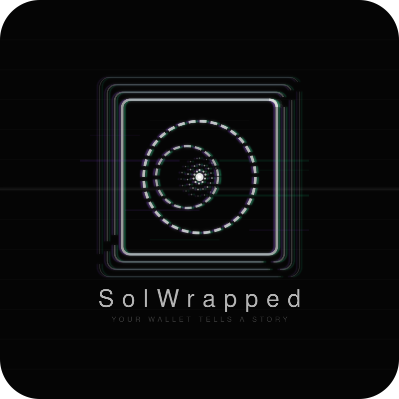
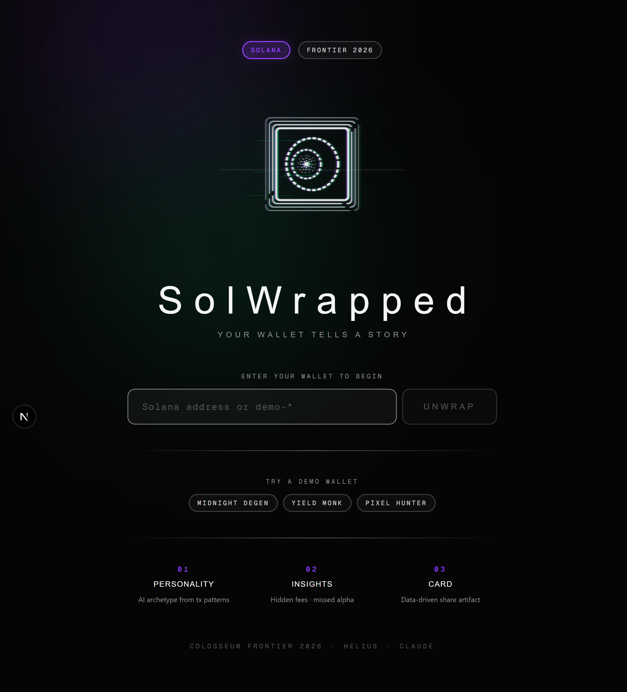
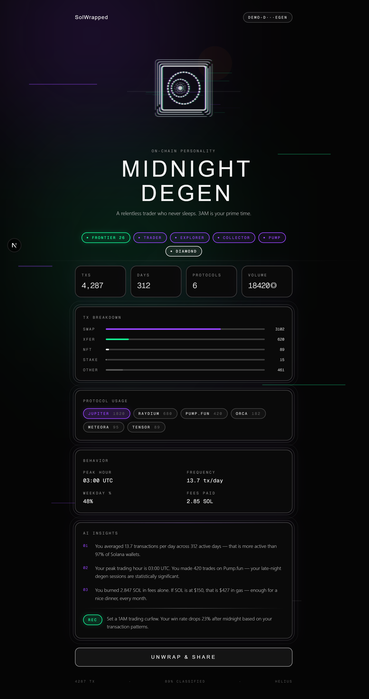
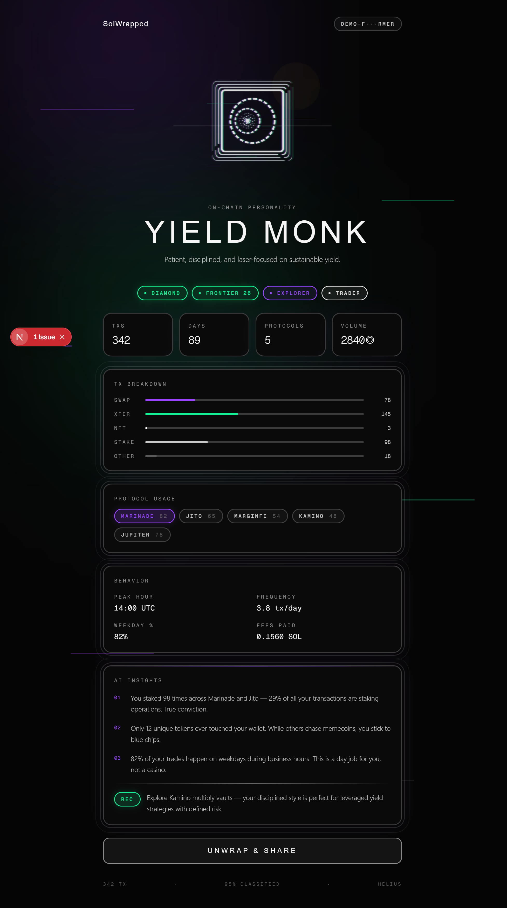
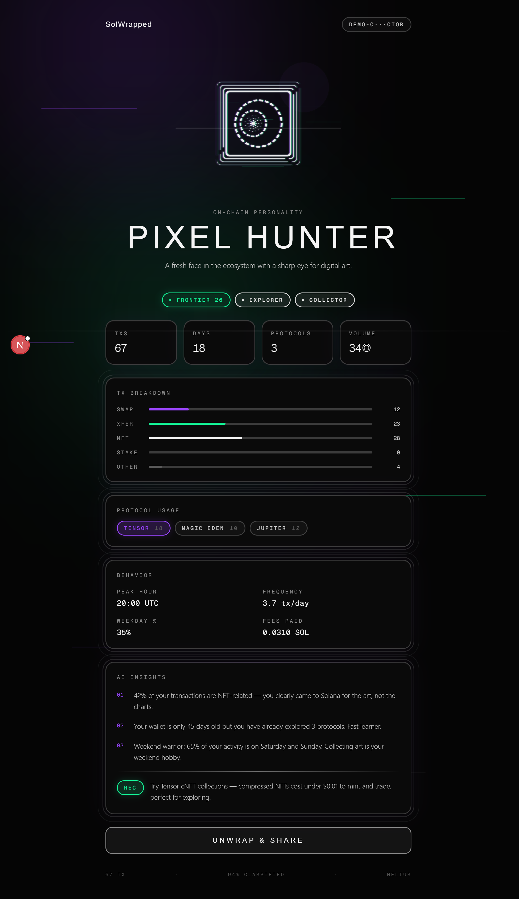
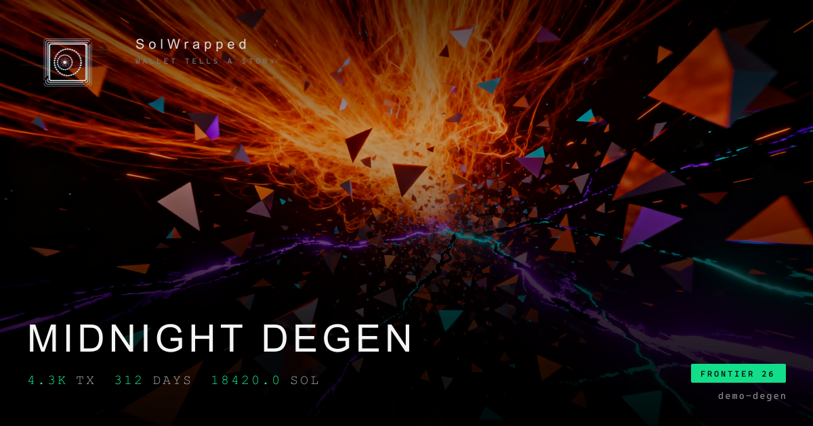
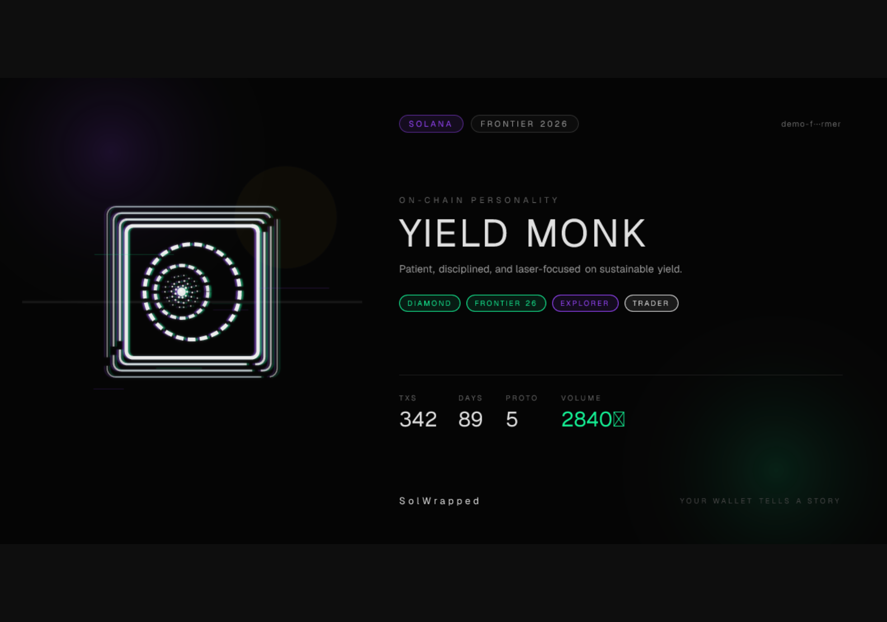
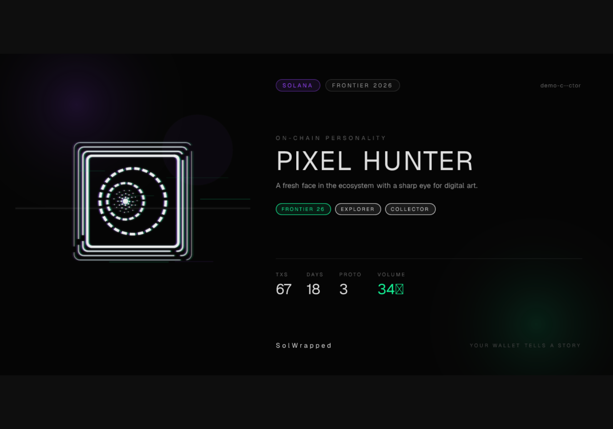

<div align="center">



# SolWrapped

### Your wallet tells a story. AI reads the chain.

**SolWrapped** scans any Solana address, classifies every transaction, and generates a personality report — wrapped in a data-driven logo fingerprint that's visually unique to each wallet.

[Demo Wallets](#demo-wallets) · [Visual Language](#visual-language) · [Architecture](#architecture) · [Getting Started](#getting-started)

*Built for Colosseum Frontier 2026*

</div>

---

## What It Does

Paste any Solana address. In seconds, SolWrapped:

1. **Fetches** full transaction history via Helius Enhanced API
2. **Classifies** every tx — swaps, transfers, NFTs, staking, protocol usage
3. **Analyzes** behavioral patterns — peak hours, frequency, weekday ratios
4. **Generates** an AI personality profile (witty, data-driven)
5. **Paints** a parametric Logo — your on-chain fingerprint, no two alike
6. **Awards** achievement badges (bronze / silver / gold rarity)
7. **Themes** the report with a subtle personality accent
8. **Renders** a shareable OG image for Twitter / social previews

## Visual Language

The entire design is anchored to a single aesthetic:

- **Base**: deep black `#050505 → #0a0a0a`
- **Channels**: Solana purple `#9945FF` and teal `#14F195`, offset ±5px to create the signature RGB-shift "data distortion"
- **Typography**: Helvetica Neue Ultra Light + mono for data
- **Texture**: scan lines, topographic contour borders, subtle dashed rings

Personality themes are **accent tints** — they subtly color glows and highlights on top of the shared dark base, never dominating it. This keeps every wallet visually coherent while still feeling personal.

## The Parametric Logo

Every wallet gets a **unique** logo SVG — not just themed, but procedurally generated from on-chain data. The logo is composed of three RGB-shifted channels (purple / teal / white) with an iris + pupil eye that tracks your cursor on the landing page.

| Logo element | Driven by | Visual effect |
|--------------|-----------|----------------|
| Particle ring density (3 rings) | `totalTransactions` | More activity → denser pupil, more vitality |
| Inner ring dash cadence | `tradingFrequency` | High-frequency → tighter dashes |
| RGB channel offset | `activeProtocols.length` | More protocols → wider chromatic separation |
| Glitch slice count | `swapCount / total` ratio | Heavy swapper → more visual noise |
| Top-right corner glow | `peakHour` (0-5 UTC) | Night owls → stronger "unwrap" glow |
| Accent tint | Personality theme | Subtle color wash over top-right quadrant |

Every address produces a deterministic, reproducible fingerprint — the seed is an FNV-1a hash of the address, so the same wallet always renders the same logo.

On the landing page the logo is **interactive** — iris and pupil track the cursor at different magnitudes (0.4× vs 1.0×), so the pupil rolls inside the iris.

## Personality Archetypes

The AI picks one of six archetypes based on your on-chain behavior. Each archetype maps to a subtle accent that tints the report's glows and highlights:

| Archetype | Accent | Who Gets It |
|-----------|--------|-------------|
| `MIDNIGHT DEGEN` | Orange `#f97316` | High-frequency traders, 3AM apes, Pump.fun regulars |
| `YIELD MONK` | Gold `#eab308` | Stakers, yield farmers, Marinade / Jito power users |
| `PIXEL HUNTER` | Violet `#9945FF` (Solana purple) | NFT collectors, digital art hunters, Tensor users |
| `ALPHA SNIPER` | Teal `#14F195` (Solana teal) | Whales, OGs, veterans, high-conviction traders |
| `FRESH EXPLORER` | Pink `#ec4899` | New wallets, curious newcomers |
| `DIAMOND HANDS` | Cyan `#22d3ee` | HODLers, long-term conviction holders |

## Badges

Each wallet unlocks achievements. Rarity colors map directly to the design system:

- **Bronze** — white `#e0e0e0`, baseline milestone
- **Silver** — Solana purple `#9945FF`, notable achievement
- **Gold** — Solana teal `#14F195`, elite tier

| Badge | Bronze | Silver | Gold |
|-------|--------|--------|------|
| **TRADER** | 100+ tx | 1,000+ tx | 5,000+ tx |
| **DIAMOND** | 5+ stakes | 20+ stakes | 50+ stakes |
| **EXPLORER** | 3+ protocols | 5+ protocols | 10+ protocols |
| **COLLECTOR** | 10+ NFT tx | 50+ NFT tx | 100+ NFT tx |
| **NIGHT OWL** | peak 0-5 UTC | — | — |
| **PUMP** | — | 10+ Pump.fun tx | — |
| **FRONTIER 26** | — | — | Generated during Colosseum 2026 window |

## Screenshots

<table>
<tr>
<td align="center" colspan="3"><strong>Landing</strong> — interactive logo tracks cursor</td>
</tr>
<tr>
<td colspan="3"></td>
</tr>
<tr>
<td align="center"><strong>MIDNIGHT DEGEN</strong></td>
<td align="center"><strong>YIELD MONK</strong></td>
<td align="center"><strong>PIXEL HUNTER</strong></td>
</tr>
<tr>
<td></td>
<td></td>
<td></td>
</tr>
</table>

**OG share card** (auto-generated per wallet, themed subtly):

<p>



</p>

## Demo Wallets

Try these instantly — no API key required:

| Input | Personality | Accent |
|-------|-------------|--------|
| `demo-degen` | `MIDNIGHT DEGEN` | Orange |
| `demo-farmer` | `YIELD MONK` | Gold |
| `demo-collector` | `PIXEL HUNTER` | Violet |

## Architecture

```
                ┌─────────────┐
                │   Browser    │
                │  (Next.js)   │
                └──────┬───────┘
                       │
          ┌────────────┼────────────┐
          ▼            ▼            ▼
   ┌─────────┐  ┌──────────┐  ┌─────────────┐
   │ /report  │  │ /api/og  │  │ /api/analyze │
   │  (page)  │  │ (image)  │  │   (engine)   │
   └────┬─────┘  └────┬─────┘  └──────┬──────┘
        │              │                │
        │         ┌────┴─────┐   ┌──────┴────┐
        │         │ logo-svg │   │ helius.ts  │ ← Helius Enhanced API
        │         │ themes   │   └──────┬────┘
        │         │ badges   │          │
        │         └──────────┘   ┌──────┴────┐
        │                        │analyzer.ts │ ← Tx classify + profile
        │                        └──────┬────┘
        │                               │
        │                        ┌──────┴────┐
        │                        │   ai.ts   │ ← Claude API (personality)
        │                        └──────┬────┘
        │                               │
        └───────────────┬───────────────┘
                        ▼
                 ┌─────────────┐
                 │  cache.ts    │ ← In-memory TTL cache
                 └─────────────┘
```

### Tech Stack

| Layer | Technology |
|-------|-----------|
| Framework | Next.js 16 (App Router, Turbopack) |
| UI | Tailwind CSS 4, Framer Motion 12 |
| Blockchain Data | Helius Enhanced Transactions API |
| AI | Claude (Anthropic API) |
| OG Images | `next/og` (Edge Runtime, Satori) |
| Language | TypeScript (strict) |

### Key Files

```
src/
├── lib/
│   ├── types.ts        # Core types (Badge, Theme, Profile, Report)
│   ├── helius.ts       # Helius API client (paginated fetch)
│   ├── analyzer.ts     # Transaction classifier + profiler
│   ├── ai.ts           # Claude prompt + response parser
│   ├── themes.ts       # 6-accent subtle-tint design system
│   ├── logo-svg.ts     # Parametric Logo SVG generator (data-driven)
│   ├── badges.ts       # Achievements + rarity logic
│   ├── cache.ts        # In-memory TTL cache
│   └── demo-data.ts    # 3 demo wallet profiles
├── components/
│   └── Logo.tsx        # React wrapper — reactive eye-tracking
├── app/
│   ├── page.tsx        # Landing (interactive logo hero)
│   ├── report/[address]/
│   │   ├── page.tsx    # Themed report + animations
│   │   └── layout.tsx  # Dynamic OG meta tags
│   └── api/
│       ├── analyze/    # Full pipeline endpoint
│       └── og/         # Dynamic OG image generation
```

## Getting Started

### Prerequisites

- Node.js 18+
- pnpm

### Install

```bash
git clone https://github.com/KuaaMU/solwrapped-app.git
cd solwrapped-app
pnpm install
```

### Configure

Create `.env.local`:

```env
HELIUS_API_KEY=your_helius_key    # Required for real wallets
ANTHROPIC_API_KEY=your_claude_key  # Required for AI personality
```

> Demo wallets work without any API keys.

### Run

```bash
pnpm dev
```

Open [http://localhost:3000](http://localhost:3000). Try `demo-degen` to see it in action.

### Build

```bash
pnpm build && pnpm start
```

## How the AI Works

The analyzer builds a behavioral profile from raw transactions:

```json
{
  "totalTxs": 4287,
  "swaps": 3102,
  "peakHour": 3,
  "weekdayRatio": 0.48,
  "topProtocols": [["Jupiter", 1820], ["Raydium", 680]],
  "uniqueTokens": 284
}
```

Claude receives this data and returns a personality:

```json
{
  "personality": "MIDNIGHT DEGEN",
  "personalityEmoji": "🌙",
  "themeId": "orange",
  "insights": [
    "You averaged 13.7 transactions per day — more active than 97% of wallets.",
    "Your peak trading hour is 03:00 UTC. Late-night degen sessions.",
    "You burned 2.847 SOL in fees alone."
  ],
  "recommendation": "Set a 1AM trading curfew."
}
```

The same profile also drives the parametric logo parameters — vitality (from `totalTxs`), frequency, diversity, chaos, nocturne — so the visual fingerprint is consistent with the written personality.

## Roadmap

- [x] Helius transaction fetching + classification
- [x] Claude AI personality generation
- [x] 6-archetype subtle-accent design system
- [x] Framer Motion animated report page
- [x] Dynamic OG image generation (themed)
- [x] Twitter / X share integration
- [x] Parametric data-driven Logo SVG
- [x] Interactive eye-tracking (iris + pupil independent motion)
- [x] Badge / achievement system (bronze / silver / gold)
- [x] Frontier 2026 commemorative badge (hackathon window)
- [ ] LLM provider abstraction (OpenAI / DeepSeek / OpenRouter / Gemini)
- [ ] fal.ai abstract-art share card pipeline
- [ ] Share modal polish (copy image, download)
- [ ] Wallet adapter connect flow
- [ ] Farcaster Frames support
- [ ] Historical comparison (month-over-month)

## License

MIT

---

<div align="center">
<sub>Built with Helius, Claude, and too much caffeine for Colosseum Frontier 2026</sub>
</div>
